# gitgist

**Turn a range of git commits into release notes your users will actually
read.** Point `gitgist` at everything since your last tag and it returns clean,
grouped Markdown — written by Claude, with the internal noise stripped out.

<p align="center">
  
</p>

## Why gitgist

- **AI-written, sections that adapt.** Claude groups commits into whatever
  sections fit the actual work — Features, Bug Fixes, Performance, Breaking
  Changes, … — and rewrites terse commit subjects into user-facing lines.
- **Noise filtered automatically.** Refactors, test-only changes, CI tweaks,
  dependency bumps, and ticket IDs don't make the cut.
- **No API key required.** By default gitgist runs on your signed-in
  [`claude`](https://www.npmjs.com/package/@anthropic-ai/claude-code) CLI — zero
  config. Prefer the API? Set `ANTHROPIC_API_KEY`.
- **Summarize uncommitted work too.** Point it at your staged/unstaged/untracked
  changes (`--staged`, `--working`, …) to preview notes for work that isn't
  committed yet — or add `--commit-message` to draft a Conventional Commit
  message straight from the staged diff.
- **Bring your own template.** `--template notes.md` shapes the output to your
  team's house style — fixed section set, order, emoji, and per-section AI
  guidance — via a simple Markdown-with-frontmatter file.
- **Works offline too.** `--no-ai` groups by Conventional Commit type with no
  network, no key, and fully deterministic output.
- **CLI _and_ library.** Use the `gitgist` bin, or call `generateReleaseNotes()`
  from your release tooling.
- **Pluggable providers.** Claude (CLI + API), any local OpenAI-compatible
  endpoint (Ollama / LM Studio), and on-device Apple Foundation Models ship
  today; Codex, Gemini, and Cursor are on the way — CLI-first wherever the tool
  offers a headless mode.

## See it

**AI release notes** — `gitgist v1.0.0..HEAD --title "v1.5.0"`

<p align="center">
  
</p>

**Commit message from your staged diff** — `gitgist --staged --commit-message`

<p align="center">
  
</p>

**Offline mode** — `gitgist v1.0.0..HEAD --no-ai`

<p align="center">
  
</p>

## Install

```bash
npm install -g gitgist     # or: npx gitgist …
```

## Usage

```bash
# Release notes from a tag to HEAD
gitgist v2.0 HEAD

# Range form, with a version heading
gitgist v1.4.0..HEAD --title "v1.5.0"

# No range given → from the latest tag (or full history) to HEAD
gitgist

# Summarize uncommitted work (no range)
gitgist --staged          # just the staged diff
gitgist --working         # staged + unstaged + untracked

# Draft a Conventional Commit message from the staged diff
gitgist --staged --commit-message

# Fold pending changes into a range's notes
gitgist v1.4.0..HEAD --untracked

# Use a local model (Ollama / LM Studio) — free, private, no API key
gitgist v1.4.0..HEAD --provider local --model llama3.2

# Shape the output to your team's template (sections, order, guidance)
gitgist v1.4.0..HEAD --template release-notes.md

# Offline, no AI — group by Conventional Commit type
gitgist --no-ai
```

A template is a Markdown file whose headings define the section order and whose
optional YAML frontmatter / `<!-- comments -->` steer the AI — see
[`docs/4-templates.md`](docs/4-templates.md) and the
[example template](templates/release-notes.example.md).

| Flag                       | Description                                                          |
| -------------------------- | ------------------------------------------------------------------- |
| `--staged`, `--cached`     | Include staged changes (`git diff --staged`).                       |
| `--unstaged`               | Include unstaged changes to tracked files (`git diff`).             |
| `--untracked`              | Include untracked (new) files.                                      |
| `--working`, `--uncommitted` | Include all uncommitted work (staged + unstaged + untracked).      |
| `--format <notes\|commit>` | Output shape: themed notes (default) or a Conventional Commit message. |
| `--commit-message`         | Shorthand for `--format commit` (requires AI).                      |
| `--template <file>`        | Shape the notes with a Markdown template ([docs](docs/4-templates.md)). |
| `--no-ai`                  | Group commits by Conventional Commit type instead (offline).        |
| `--provider <name>`        | `auto` \| `claude-cli` \| `anthropic-api` \| `local` \| `apple` (default: `auto`). |
| `--endpoint <url>`         | Base URL for `--provider local` (default: Ollama's `…:11434/v1`).   |
| `--model <id>`             | `anthropic-api` model (default `claude-opus-4-8`), or the `local` model name. |
| `--max-tokens <n>`         | Max output tokens for the `anthropic-api` provider (default: 16000). |
| `--title <text>`           | Render `<text>` as a top-level heading above the notes.             |
| `--cwd <path>`             | Run against the git repository at `<path>`.                         |
| `-h, --help`               | Show help.                                                          |

> **Working-tree flags** summarize uncommitted changes. With no range they
> summarize only the pending changes (great for a commit message); with a range
> they're folded in alongside the commits.

## AI providers & API keys

gitgist prefers **zero-config CLI backends that need no API key** — the same
approach the related tools take with `claude -p`. Three backends ship today:

1. **`claude-cli`** — your locally installed, signed-in `claude` CLI. **No API
   key** — it reuses the CLI's own auth.
2. **`anthropic-api`** — the Anthropic API via the official SDK. Set
   `ANTHROPIC_API_KEY` in your environment.
3. **`local`** — any **OpenAI-compatible** endpoint (Ollama, LM Studio,
   llama.cpp, vLLM, …) for free, private, on-device generation. Opt-in with
   `--provider local`; configure with `--endpoint` (`$GITGIST_LOCAL_ENDPOINT`,
   default `http://localhost:11434/v1`) and `--model` (`$GITGIST_LOCAL_MODEL`,
   else the endpoint's first model). No API key.
4. **`apple`** — on-device **Apple Foundation Models** (macOS 26+ on Apple
   Silicon with Apple Intelligence). Free, private, no API key. Powered by the
   [`apple-fm`](https://www.npmjs.com/package/apple-fm) package, a gitgist
   dependency that bundles a **Developer-ID-signed, notarized** helper binary, so
   it works out of the box — no toolchain required. Point gitgist at a custom
   helper build with `APPLE_FM_BIN`.

With `--provider auto` (the default), gitgist uses the `claude` CLI when it's
installed, falls back to the Anthropic API when `ANTHROPIC_API_KEY` is set, and
then to on-device Apple Foundation Models when the device and model are
available — a no-op when they aren't. The `local` provider is **never** auto-selected (so a normal run
doesn't probe localhost) — request it explicitly. Force any with
`--provider <name>`. If no provider is available, use `--no-ai` for offline
Conventional Commits grouping.

> Planned providers follow the same **CLI-first, no-key** pattern wherever the
> tool offers a headless mode — Codex (`codex exec`), Gemini CLI, Cursor agent —
> alongside on-device Apple Foundation Models and local OpenAI-compatible
> endpoints (Ollama / LM Studio). The provider layer is pluggable, and CLI
> backends share a small `createCliProvider()` helper.

### Choosing a provider

The backends differ in output quality as well as cost, privacy, and latency. As
a rule of thumb, larger models categorize and filter noise more reliably:

| Provider | Quality | Cost | Privacy | Notes |
| --- | --- | --- | --- | --- |
| `claude-cli` / `anthropic-api` | **Best** | CLI: included with your plan · API: per-token | Sent to Anthropic | Cleanest grouping; Breaking Changes surfaced first; refactor/test/chore noise dropped. |
| `local` (Ollama / LM Studio) | Very good | Free | **On-device** | Same shape as Claude on a capable model; minor ordering differences. Quality tracks the model you load. |
| `apple` (Foundation Models) | Usable, weaker | Free | **On-device** | Smallest model — can miscategorize (e.g. a breaking change under Features), invent sections, or keep an internal commit. Free, private, fast. |
| `--no-ai` | Deterministic | Free | **No network** | Conventional-Commits grouping; keeps every commit, no rewriting. The offline baseline. |

**Pick by what you care about most:** best notes → Claude; private/free with
good quality → `local` with a capable model; private/free/fast on a Mac with
nothing to install → `apple`; reproducible and offline → `--no-ai`.

<details>
<summary><strong>See it: the same 10 commits through three backends</strong> (real <code>npm&nbsp;run&nbsp;compare</code> output)</summary>

The history mixes real user-facing work (a breaking `feat!: drop Node 18`, two
features, two fixes, a perf win) with noise that good notes should drop (a
`docs:` tweak, a `refactor:`, a `test:`, a `chore:` dep bump).

**`claude-cli` (Claude)** — tightest. Breaking Changes first; the `docs:`,
`refactor:`, `test:`, and `chore:` commits are all dropped as noise:

```markdown
## Breaking Changes
- Dropped support for Node 18 — Node 20 is now the minimum required version.

## Features
- Added cursor-based pagination to the list endpoint.
- Added a dark-mode toggle to the settings page.

## Bug Fixes
- Expired authentication tokens are now rejected with a proper error instead of a 500.
- Fixed the sidebar flickering on window resize.

## Performance
- Cached compiled regexes for roughly 3x faster cold start.
```

**`local` (Ollama, `llama3.2`)** — very close, but kept the `docs:` commit as a
Documentation section and ordered Performance ahead of Bug Fixes:

```markdown
## Breaking Changes
- Support for Node.js 18 has been dropped; the minimum supported version is now Node.js 20.

## Features
- Added a dark mode toggle to the settings page.
- Introduced cursor-based pagination for list endpoints.

## Performance
- Cached compiled regular expressions, significantly improving cold start performance.

## Bug Fixes
- Fixed an issue where the sidebar would flicker when resizing the window.
- Improved auth handling by rejecting expired tokens with a specific error instead of a 500 response.

## Documentation
- Expanded the quickstart guide with more comprehensive examples.
```

**`--no-ai`** — deterministic baseline. Keeps every commit verbatim with its
hash, no rewriting and no noise-filtering — so the breaking change appears under
both Breaking Changes *and* Features, and the refactor/test/chore commits stay:

```markdown
## ⚠ BREAKING CHANGES
- drop Node 18; the minimum supported version is now Node 20 (`cff23c3`)

## Features
- drop Node 18; the minimum supported version is now Node 20 (`cff23c3`)
- **ui:** add a dark-mode toggle to the settings page (`29cef29`)
- **api:** add cursor-based pagination to the list endpoint (`aebce25`)

## Bug Fixes
- stop the sidebar from flickering on window resize (`d0e275b`)
- **auth:** reject expired tokens instead of returning a 500 (`69ef42a`)

## Performance
- cache compiled regexes — about 3x faster cold start (`75e07cd`)

## Refactoring
- split the loader into smaller modules (`1758a1e`)

## Documentation
- expand the quickstart with a tag-to-HEAD example (`0ef0091`)

## Tests
- add coverage for the range parser (`68869fd`)

## Chores
- bump eslint to v10 (`1458698`)
```

</details>

Want to judge for yourself? `npm run compare` runs the same fixed history
through every backend available on your machine and prints the results side by
side (see `scripts/compare-providers.mjs`).

## Library

```ts
import { generateReleaseNotes } from 'gitgist';

// AI-organized notes
const notes = await generateReleaseNotes({
  from: 'v1.0.0',
  to: 'HEAD',
  title: 'v1.1.0',
});
console.log(notes);

// Deterministic, offline grouping (no AI)
const changelog = await generateReleaseNotes({ from: 'v1.0.0', ai: false });
```

Lower-level building blocks are exported too — `readCommits`,
`resolveCommitRange`, `parseCommit`, `buildChangelog`, `renderMarkdown`, the
`resolveProvider` / provider registry, and the prompt builders — for callers
that want to customize any stage of the pipeline. See
[`docs/`](docs/) for the architecture and requirements.

## Development

```bash
npm install
npm test          # unit + integration tests with coverage
npm run lint
npm run typecheck
npm run build
npm run demo      # re-capture the README demo SVGs (assets/demos/)
npm run diagram   # re-capture the README flow diagram (assets/diagram.svg)
npm run compare   # run the same changes through every available provider, side by side
```

## License

MIT © Brian Westphal
