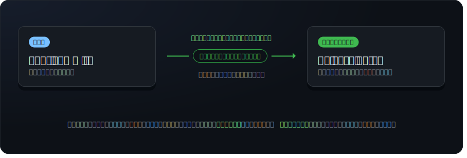

# gitgist

**Turn a range of git commits into release notes your users will actually
read.** Point `gitgist` at everything since your last tag and it returns clean,
grouped Markdown — written by Claude, with the internal noise stripped out.

<p align="center">
  
</p>

## Why gitgist

- **AI-written, sections that adapt.** Claude groups commits into whatever
  sections fit the actual work — Features, Bug Fixes, Performance, Breaking
  Changes, … — and rewrites terse commit subjects into user-facing lines.
- **Noise filtered automatically.** Refactors, test-only changes, CI tweaks,
  dependency bumps, and ticket IDs don't make the cut.
- **No API key required.** By default gitgist runs on your signed-in
  [`claude`](https://www.npmjs.com/package/@anthropic-ai/claude-code) CLI — zero
  config. Prefer the API? Set `ANTHROPIC_API_KEY`.
- **Summarize uncommitted work too.** Point it at your staged/unstaged/untracked
  changes (`--staged`, `--working`, …) to preview notes for work that isn't
  committed yet — or add `--commit-message` to draft a Conventional Commit
  message straight from the staged diff.
- **Works offline too.** `--no-ai` groups by Conventional Commit type with no
  network, no key, and fully deterministic output.
- **CLI _and_ library.** Use the `gitgist` bin, or call `generateReleaseNotes()`
  from your release tooling.
- **Pluggable providers.** Claude ships today; Codex, Gemini, Cursor, Apple
  Foundation Models, and local Ollama / OpenAI-compatible models are on the way
  — CLI-first wherever the tool offers a headless mode.

## See it

**AI release notes** — `gitgist v1.0.0..HEAD --title "v1.5.0"`

<p align="center">
  
</p>

**Offline mode** — `gitgist v1.0.0..HEAD --no-ai`

<p align="center">
  
</p>

## Install

```bash
npm install -g gitgist     # or: npx gitgist …
```

## Usage

```bash
# Release notes from a tag to HEAD
gitgist v2.0 HEAD

# Range form, with a version heading
gitgist v1.4.0..HEAD --title "v1.5.0"

# No range given → from the latest tag (or full history) to HEAD
gitgist

# Summarize uncommitted work (no range)
gitgist --staged          # just the staged diff
gitgist --working         # staged + unstaged + untracked

# Draft a Conventional Commit message from the staged diff
gitgist --staged --commit-message

# Fold pending changes into a range's notes
gitgist v1.4.0..HEAD --untracked

# Offline, no AI — group by Conventional Commit type
gitgist --no-ai
```

| Flag                       | Description                                                          |
| -------------------------- | ------------------------------------------------------------------- |
| `--staged`, `--cached`     | Include staged changes (`git diff --staged`).                       |
| `--unstaged`               | Include unstaged changes to tracked files (`git diff`).             |
| `--untracked`              | Include untracked (new) files.                                      |
| `--working`, `--uncommitted` | Include all uncommitted work (staged + unstaged + untracked).      |
| `--format <notes\|commit>` | Output shape: themed notes (default) or a Conventional Commit message. |
| `--commit-message`         | Shorthand for `--format commit` (requires AI).                      |
| `--no-ai`                  | Group commits by Conventional Commit type instead (offline).        |
| `--provider <name>`        | `auto` \| `anthropic-api` \| `claude-cli` (default: `auto`).         |
| `--model <id>`             | Model for the `anthropic-api` provider (default: `claude-opus-4-8`). |
| `--max-tokens <n>`         | Max output tokens for the `anthropic-api` provider (default: 16000). |
| `--title <text>`           | Render `<text>` as a top-level heading above the notes.             |
| `--cwd <path>`             | Run against the git repository at `<path>`.                         |
| `-h, --help`               | Show help.                                                          |

> **Working-tree flags** summarize uncommitted changes. With no range they
> summarize only the pending changes (great for a commit message); with a range
> they're folded in alongside the commits.

## AI providers & API keys

gitgist prefers **zero-config CLI backends that need no API key** — the same
approach the related tools take with `claude -p`. Two Claude backends ship
today:

1. **`claude-cli`** — your locally installed, signed-in `claude` CLI. **No API
   key** — it reuses the CLI's own auth.
2. **`anthropic-api`** — the Anthropic API via the official SDK. Set
   `ANTHROPIC_API_KEY` in your environment.

With `--provider auto` (the default), gitgist uses the `claude` CLI when it's
installed, and falls back to the Anthropic API when `ANTHROPIC_API_KEY` is set.
Force one with `--provider claude-cli` / `--provider anthropic-api`. If no
provider is available, use `--no-ai` for offline Conventional Commits grouping.

> Planned providers follow the same **CLI-first, no-key** pattern wherever the
> tool offers a headless mode — Codex (`codex exec`), Gemini CLI, Cursor agent —
> alongside on-device Apple Foundation Models and local OpenAI-compatible
> endpoints (Ollama / LM Studio). The provider layer is pluggable, and CLI
> backends share a small `createCliProvider()` helper.

## Library

```ts
import { generateReleaseNotes } from 'gitgist';

// AI-organized notes
const notes = await generateReleaseNotes({
  from: 'v1.0.0',
  to: 'HEAD',
  title: 'v1.1.0',
});
console.log(notes);

// Deterministic, offline grouping (no AI)
const changelog = await generateReleaseNotes({ from: 'v1.0.0', ai: false });
```

Lower-level building blocks are exported too — `readCommits`,
`resolveCommitRange`, `parseCommit`, `buildChangelog`, `renderMarkdown`, the
`resolveProvider` / provider registry, and the prompt builders — for callers
that want to customize any stage of the pipeline. See
[`docs/`](docs/) for the architecture and requirements.

## Development

```bash
npm install
npm test          # unit + integration tests with coverage
npm run lint
npm run typecheck
npm run build
npm run demo      # re-capture the README demo SVGs (assets/demos/)
npm run diagram   # re-capture the README flow diagram (assets/diagram.svg)
```

## License

MIT © Brian Westphal
